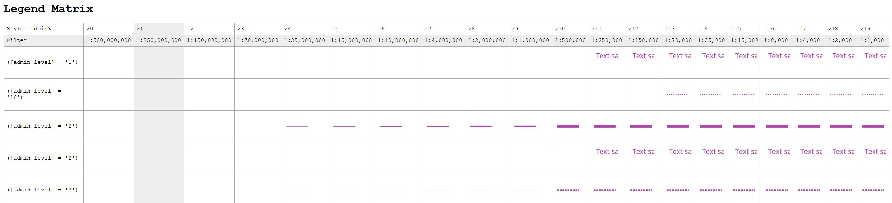

# Creation of a Mulit-Scale Legend Matrix

The most web map did not have any legend. This tool collection tries to generate something similiar to a legend from a Mapnik style-file. The result is a big matrix showing which features are how visualized depending on the scale/zoom-level. A manualy created example can you find [here](https://mathiasgroebe.github.io/Multi-Scale-Legend/Legend.html).

## Workflow

The script ``generate_table.py`` read the styling rules in the XML file and store them into a SQLite database. In the `SQL` folder are some useful scripts for creation the database, grouping layers and setting vales. Out of the SQLite database ``generate_table.py`` generates a HTML document which contians the legend matrix.

## Note

The by practical reasons included style-file and the symbols are form the [OSM-Carto Style](https://github.com/gravitystorm/openstreetmap-carto). The XML-file was created form using [Carto](https://github.com/mapbox/carto). Every other Mapnik-stylsheet should also work. You also have to install the Noto font, that is used by the map style.

## ToDo

 - Fixed table header
 - Colorize markers
 - Implement image filter
 - Clean python code
 - Write documentation
 - Test with other map styles than OSM Carto